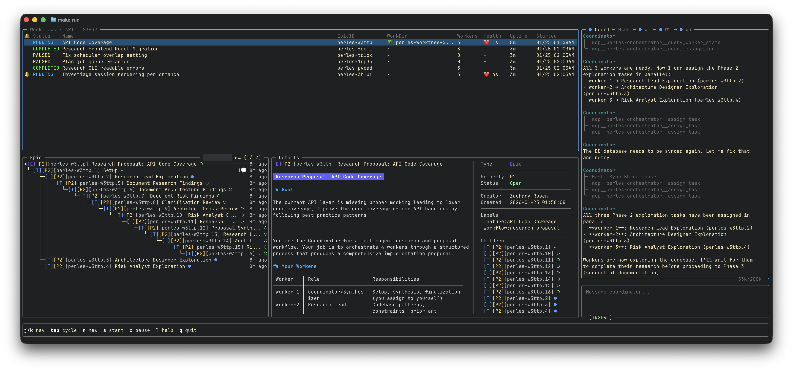
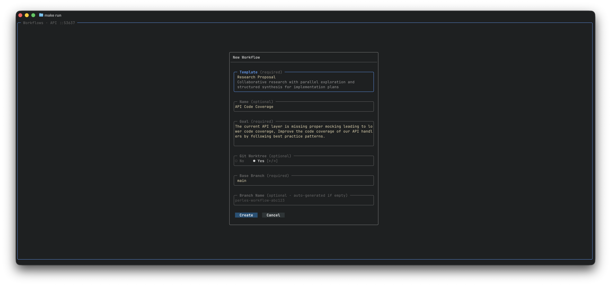

# Orchestration

!!! warning "Cost Warning"
    Orchestration mode spawns multiple headless AI agents. If you care about cost, use it carefully. Every headless agent runs with **full permissions**.

Orchestration mode is a multi-agent control plane that launches workflows where a single coordinator agent manages spawning, replacing, and retiring headless worker agents through built-in MCP tools. The coordinator delegates sub-tasks to multiple workers so you don't have to manually manage sessions.

- **Coordinator**: A single headless agent that receives workflow instructions and manages the session
- **Workers**: Multiple headless agents that execute specific sub-tasks (coding, testing, reviewing, documenting)



---

## Getting Started

1. Open Perles in your project directory
2. Press `ctrl+o` to enter orchestration mode
3. Select a workflow template and fill in any required fields

A typical coding workflow spans multiple workflow sessions:

1. **Research Proposal** -- Generate a proposal document
2. **Research to Tasks** -- Break down the proposal into beads epics and tasks
3. **Cook** -- Work through the entire epic's tasks with code review

---

## Configuration

The default settings use Claude Code. Customize in `~/.config/perles/config.yaml`:

```yaml
orchestration:
  coordinator_client: "claude"  # Options: claude, amp, codex, opencode
  worker_client: "claude"       # Options: claude, amp, codex, opencode

  # Provider-specific settings
  claude:
    model: "opus"               # Options: sonnet, opus, haiku
  amp:
    model: "opus"               # Options: opus, sonnet
    mode: "smart"               # Options: free, rush, smart
  codex:
    model: "gpt-5.2-codex"      # Options: gpt-5.2-codex, o4-mini
```

---

## Git Worktrees

Any workflow supports working inside a git worktree. When using a worktree you can specify a different base branch and an optional branch name. Worktrees are primarily useful when running multiple "Cook" workflows on different epics in parallel.

Research and planning workflows typically don't need worktrees since they don't change code.



---

## Layout

### Workflows Pane

Every launched workflow appears in a table showing status, epic ID, working directory, and last heartbeat.

- **Pause**: Press `x` to stop all running processes for the selected workflow
- **Resume**: Press `s` to resume a paused workflow
- **New**: Press `n` to launch a new workflow

### Coordinator Pane

The headless AI agent that plans and delegates work. Communicate via the chat input.

**What you see:**

- Status indicator showing coordinator state
- Token usage metrics (context consumption)
- Queue count when messages are pending
- Full conversation history

**Status indicators:**

| Icon | Meaning |
|------|---------|
| `●` (blue) | Working -- actively processing |
| `○` (green) | Ready -- waiting for input |
| `⏸` | Paused -- workflow paused |
| `⚠` (yellow) | Stopped -- needs attention |
| `✗` (red) | Failed -- error occurred |

### Message Log (Tab)

Timeline of all inter-agent communication. Workers post to the message log when they finish their turns, which nudges the coordinator to read and act.

Workers are enforced to end their turn with an MCP tool call to post their message. If they don't, the system intercepts and reminds them.

### Worker Panes (Tabs)

Spawned workers appear as tabs showing:

- Worker ID and name (e.g., `WORKER-1 perles-abc.1`)
- Current phase: `(impl)`, `(review)`, `(commit)`, etc.
- Status indicator (same icons as coordinator)
- Token/cost metrics
- Output content

**Worker phases (Cook workflow):**

| Phase | Meaning |
|-------|---------|
| `idle` | Waiting for assignment |
| `impl` | Implementing a task |
| `review` | Reviewing work |
| `await` | Awaiting feedback |
| `feedback` | Addressing feedback |
| `commit` | Committing changes |

### Chat Input Bar

Text input for sending messages to the coordinator or workers.

**Border colors indicate message target:**

- **Teal** = Sending to coordinator
- **Green** = Sending to a specific worker
- **Orange** = Broadcasting to all

When `vim_mode` is enabled, the current vim mode is displayed.

### Epic Tree and Details

Every workflow is backed by a beads epic. View progress and task details in the tree pane. The "Cook" workflow uses an existing epic; other workflows create one automatically.

---

## Keybindings

### Dashboard Mode

| Key | Action |
|-----|--------|
| `j` / `k` | Move between workflows |
| `g` / `G` | Jump to first / last workflow |
| `Tab` / `ctrl+n` | Next focus zone |
| `Shift+Tab` / `ctrl+p` | Previous focus zone |
| `/` | Activate filter |
| `s` | Start workflow |
| `x` | Stop workflow |
| `Enter` | Focus coordinator |
| `n` | New workflow |
| `ctrl+w` | Toggle coordinator panel |
| `[` / `]` | Switch tabs |
| `?` | Help |
| `q` | Quit |

### Orchestration Mode

| Key | Action |
|-----|--------|
| `ctrl+f` | Cycle focus between panes |
| `Enter` | Send message (in chat input) |
| `ctrl+z` | Pause workflow |
| `ctrl+r` | Replace coordinator |
| `ctrl+p` | Workflow template palette |
| `?` | Help |
| `q` | Quit (with confirmation) |

### Epic Tree View

| Key | Action |
|-----|--------|
| `t` | Show/hide tree view |
| `j` / `k` | Navigate tree |
| `h` / `l` | Switch tree / details pane |
| `d` | Toggle direction |
| `m` | Toggle mode |
| `r` | Refresh |
| `ctrl+e` | Edit issue |
| `y` | Copy ID/description |

---

## Slash Commands

Control workers directly from the chat input:

| Command | Action |
|---------|--------|
| `/stop <worker-id>` | Gracefully stop a worker |
| `/retire <worker-id>` | Gracefully retire a worker |
| `/replace <worker-id>` | Replace a worker with a fresh one |

---

## Session Storage

Session data is stored in `~/.perles/sessions/`:

```
~/.perles/sessions/
├── sessions.json                    # Global session index
└── {project-name}/
    ├── sessions.json                # Per-project index
    └── 2026-01-12/
        └── {session-uuid}/
            ├── metadata.json
            ├── coordinator/
            ├── workers/
            └── messages.jsonl
```
