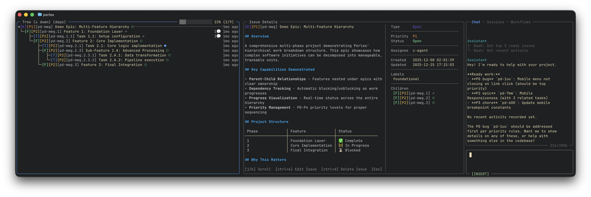
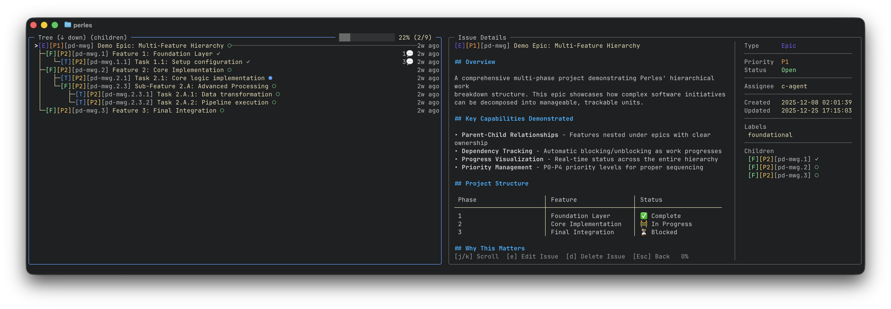

# Dependency Explorer

Visualize and navigate issue relationships -- blockers, dependencies, and parent/child hierarchies as interactive trees.

## Dependency Chain



## Parent/Child Hierarchy



---

## Accessing the Explorer

The dependency explorer is available as a sub-mode within search. Select an issue in search results and the tree view will show its relationships.

---

## Tree Modes

| Mode | Description |
|------|-------------|
| **Dependencies** (`deps`) | Issues this issue depends on -- blockers and parent issues |
| **Children** (`child`) | Issues that are children of or blocked by this issue |

Toggle between modes with `m` while in the tree view.

---

## Tree Direction

| Direction | Description |
|-----------|-------------|
| **Up** | Navigate upward through blockers and parents |
| **Down** | Navigate downward through children and blocked issues |

Toggle direction with `d` while in the tree view.

---

## Keybindings

| Key | Action |
|-----|--------|
| `j` / `k` | Move cursor up/down in tree |
| `l` / `Tab` | Focus details panel |
| `h` | Focus tree panel |
| `Enter` | Refocus tree on selected node |
| `u` | Go back to previous root |
| `U` | Go to original root |
| `d` | Toggle direction (up/down) |
| `m` | Toggle mode (deps/children) |
| `y` | Copy issue ID |
| `/` | Switch to list mode |
| `Esc` | Exit to kanban mode |

---

## Using with BQL Expand

The dependency explorer works alongside BQL's `expand` keyword. You can use expand queries to pull in related issues:

```bql
# Get an epic and all its children
type = epic expand down

# Get an issue and everything blocking it
id = bd-123 expand up

# Full relationship graph
id = bd-123 expand all depth *
```

See the [BQL Reference](../bql/index.md#expand) for full expand syntax.
