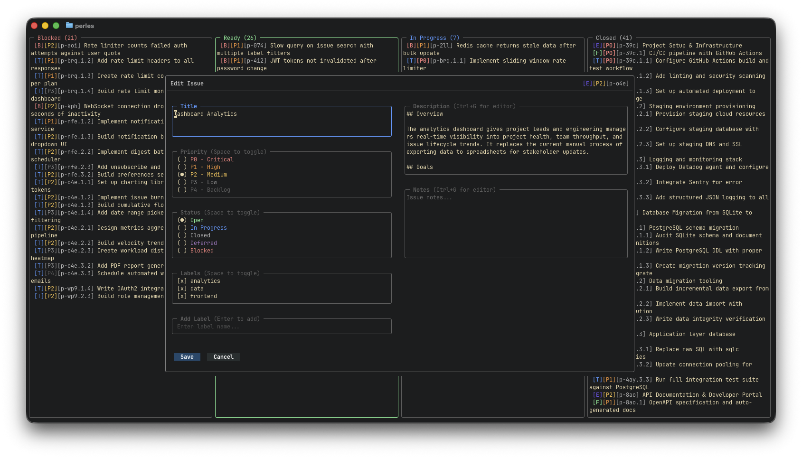

# Usage

Perles operates in multiple modes, each offering a different way to view and interact with your issues. Switch between them using keyboard shortcuts.

## Application Modes

| Mode | Access | Description |
|------|--------|-------------|
| **[Kanban](kanban.md)** | Default / `ctrl+space` | Organize issues in customizable board columns |
| **[Search](search.md)** | `ctrl+space` / `/` from kanban | Full-screen BQL search with live results |
| **[Dependency Explorer](dependency-explorer.md)** | From search results | Visualize issue relationships as trees |
| **[Orchestration](../orchestration/index.md)** | `ctrl+o` | Multi-agent AI workflow management |

## Global Keybindings

These work in every mode:

| Key | Action |
|-----|--------|
| `ctrl+space` | Switch between Kanban and Search |
| `ctrl+o` | Enter Dashboard / Orchestration mode |
| `ctrl+e` | Edit the selected issue |
| `?` | Toggle help overlay |
| `q` | Quit |
| `ctrl+c` | Force quit |

## Editing Issues

Press `ctrl+e` on any selected issue to open the issue editor. This works in kanban, search, and dependency explorer modes. From the editor you can change the title, priority, status, labels, description, and notes. Use `ctrl+g` on text fields to open your `$EDITOR` for longer edits.

