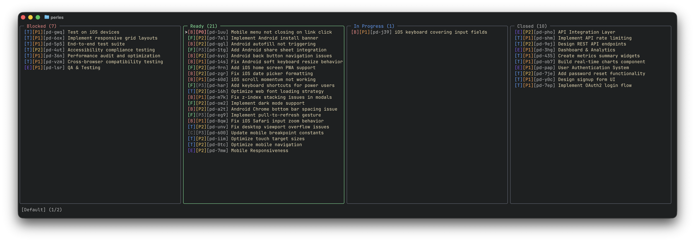
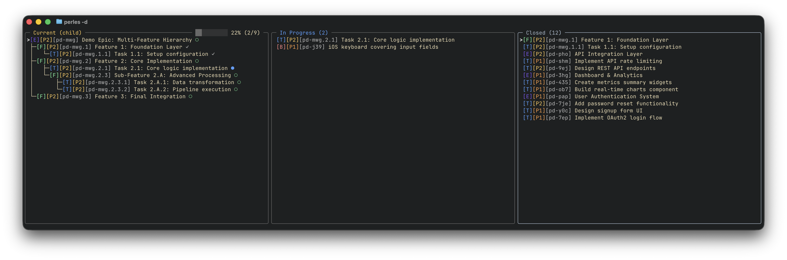

# Kanban Mode

Organize issues into customizable columns powered by BQL queries or dependency trees.



## Features

- Four-column default layout: Blocked, Ready, In Progress, Closed
- Fully customizable columns with BQL queries or dependency trees
- Multi-view support -- create unlimited board views
- Real-time auto-refresh when database changes
- Column management: add, edit, reorder, delete
- Mixed column types (BQL + dependency trees) in the same view



---

## Videos

### Navigating Views and Columns

Use `h` and `l` to move left and right between columns, `ctrl+h` / `ctrl+l` to move column positions and `ctrl+n` / `ctrl+p` to switch between views. Use `ctrl+v` to open the view menu to create, rename or delete a view.

<video src="../../assets/board.mp4" controls width="100%"></video>

### Adding a New Column

Use `a` from kanban mode to add a new column.

<video src="../../assets/add-column-from-existing.mp4" controls width="100%"></video>

---

## Default Columns

The default view includes these columns (all configurable via BQL):

| Column | BQL Query |
|--------|-----------|
| **Blocked** | `status = open and blocked = true` |
| **Ready** | `status = open and ready = true` |
| **In Progress** | `status = in_progress` |
| **Closed** | `status = closed` |

---

## Keybindings

### Navigation

| Key | Action |
|-----|--------|
| `h` / `<left>` | Move to left column |
| `l` / `<right>` | Move to right column |
| `j` / `<down>` | Move down in column |
| `k` / `<up>` | Move up in column |
| `Enter` | View issue details |

### Views

| Key | Action |
|-----|--------|
| `ctrl+j` / `ctrl+n` | Next view |
| `ctrl+k` / `ctrl+p` | Previous view |
| `ctrl+v` | View menu (Create/Delete/Rename) |
| `w` | Toggle status bar |

### Columns

| Key | Action |
|-----|--------|
| `a` | Add new column |
| `e` | Edit current column |
| `d` | Delete current column |
| `ctrl+h` | Move column left |
| `ctrl+l` | Move column right |
| `/` | Open search with column's BQL query |

### Issues

| Key | Action |
|-----|--------|
| `y` | Copy issue ID to clipboard |
| `r` | Refresh issues |
| `s` | Change status |
| `p` | Change priority |
| `ctrl+e` | Edit issue |
| `ctrl+d` | Delete issue |

---

## Column Types

### BQL Columns

BQL columns filter issues using [BQL queries](../bql/index.md). Any valid BQL expression can define a column:

```yaml
columns:
  - name: "Critical Bugs"
    type: bql
    query: "type = bug and priority = P0"
    color: "#FF8787"
```

### Tree Columns

Tree columns display dependency trees or child hierarchies rooted at a specific issue:

```yaml
columns:
  - name: "Current Work"
    type: tree
    issue_id: bd-123
    tree_mode: child    # or "deps"
    color: "#EF4444"
```

| Tree Mode | Description |
|-----------|-------------|
| `child` | Show child issues of the root issue |
| `deps` | Show dependency chain of the root issue |

---

## Views

Views are named collections of columns. You can create multiple views to organize different perspectives of your issues.

### Managing Views

- **Create**: `ctrl+v` then select "Create"
- **Switch**: `ctrl+n` (next) / `ctrl+p` (previous)
- **Rename**: `ctrl+v` then select "Rename"
- **Delete**: `ctrl+v` then select "Delete"

### Configuring Views

Views can be defined in your [configuration file](../configuration/index.md). Any changes made through the TUI (adding, editing, reordering, or deleting columns and views) are automatically saved back to the config file.

```yaml
views:
  - name: Default
    columns:
      - name: Blocked
        type: bql
        query: "status = open and blocked = true"
        color: "#FF8787"
      - name: Ready
        query: "status = open and ready = true"
        color: "#73F59F"

  - name: Bugs Only
    columns:
      - name: Open Bugs
        type: bql
        query: "type = bug and status = open"
        color: "#EF4444"
      - name: Fixed
        type: bql
        query: "type = bug and status = closed"
        color: "#10B981"
```
