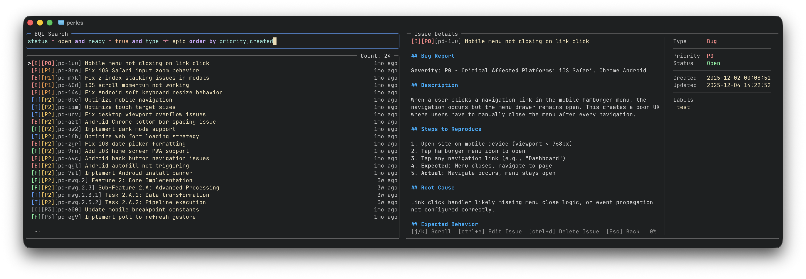

# Search Mode

Full-screen BQL-powered search interface with live results and issue details.



## Features

- Full-screen BQL-powered search interface
- Live results with detail panel
- Save searches as kanban columns
- Create new views from search results
- Sub-mode for viewing issue dependencies and hierarchies

---

## Videos

### BQL Search

Use `ctrl+space` to switch modes between Kanban and Search or while on a column use `/` to be dropped into search mode with the current column's BQL query.

<video src="../../assets/search.mp4" controls width="100%"></video>

### Creating a View from Search Results

Use `ctrl+s` from search mode to save the BQL query to a new or existing view.

<video src="../../assets/save-to-new-view.mp4" controls width="100%"></video>

---

## Using Search

1. Press `ctrl+space` from kanban mode, or `/` from a column to pre-fill its BQL query
2. Type a [BQL query](../bql/index.md) in the search input
3. Navigate results with `j`/`k`, switch between the list and details with `h`/`l`

### Saving Searches

Press `ctrl+s` to save the current search as a column in a new or existing view. This lets you build kanban boards from your most-used queries.

---

## Keybindings

| Key | Action |
|-----|--------|
| `/` | Focus search input |
| `Enter` | Execute query / Edit field |
| `h` | Move to results list |
| `l` | Move to details panel |
| `j` / `k` | Navigate results |
| `y` | Copy issue ID |
| `s` | Change status |
| `p` | Change priority |
| `ctrl+s` | Save search as column |
| `ctrl+e` | Edit issue |
| `Esc` | Exit to kanban mode |

---

## Search Examples

```bql
# Find critical bugs
type = bug and priority = P0

# Ready work excluding backlog
status = open and ready = true and label not in (backlog)

# Recently updated high-priority items
priority <= P1 and updated >= -24h order by updated desc

# Search by title
title ~ authentication or title ~ login

# Epic with its full hierarchy
type = epic expand down depth *
```

See the [BQL Reference](../bql/index.md) for the complete query language documentation.
